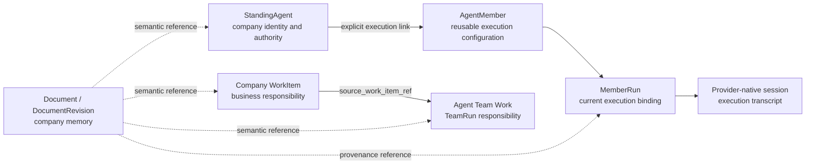
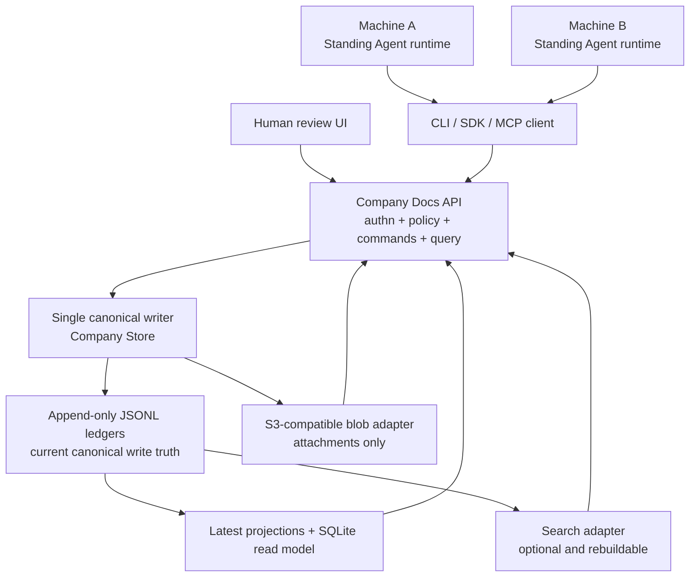

# AI-first multi-device Docs infrastructure

```text
status: research proposal; non-canonical
owner_role: Docs Governance
authority_class: research
canonical_for: nothing
decision_target: a future Docs service and multi-device storage ADR
review_trigger: Agent review, CLI/API PoC results, or a canonical Store migration proposal
based_on: origin/master da76a7b; reviewed 2026-08-04
execution_context: docs-collaboration-spec-20260804 / mission-docs-collaboration-spec / wave-docs-collaboration-spec-v1
```

## Executive decision

Company OS should **keep its product model and build its own semantic Docs
core**, while reusing external infrastructure behind narrow adapters. It should
not adopt a complete external wiki or collaborative editor as the canonical
Company OS store.

The near-term product is not a Notion editor. It is a remotely accessible,
Agent-first document service:

```text
Standing Agents on many machines
  -> stable CLI / HTTP API / MCP tools
  -> one governed Company Docs write service
  -> canonical append-only Company Store
  -> rebuildable query/search projections
```

Agents create and maintain documents. Humans primarily review current content,
relations, provenance, diffs, risk, and outcomes. A rich collaborative editor
is useful later, but it must consume the same API and must not introduce a
second source of document truth.

This proposal therefore recommends:

1. make remote CLI/API access, identity, revisioning, conflict handling, and
   provenance the first infrastructure slice;
2. retain `Document`, `Block`, `TypedRecord`, `Relation`, `View`, and
   `BusinessModule` as the Docs product model;
3. add an explicit immutable `DocumentRevision` contract and an atomic
   document change boundary before adding multi-writer deployment;
4. run one authoritative Company Store writer per Company Store in the current
   JSONL phase; remote clients never synchronize or directly write ledger
   directories;
5. use SQLite, PostgreSQL, search engines, and S3-compatible storage only in
   the roles allowed by their owning ADRs and adapters; and
6. defer BlockNote/Yjs/Hocuspocus or another rich editor stack until the
   Agent-first protocol passes its acceptance gates.

This document does not change the canonical contracts in
[Document System](../company-os/document-system.md),
[Organization and Actors](../company-os/organization-and-actors.md),
[Agent Team Works](../product/agent-team-works.md),
[ADR 0035](../decisions/0035-company-os-sql-read-model.md), or
[ADR 0050](../decisions/0050-agent-team-work-board-and-message-boundary.md).
It proposes an implementation direction for later review.

This study is intentionally kept as one review document even though it exceeds
the normal 500-line maintenance signal. Remote access, identity, revision
atomicity, storage ownership, and external-component selection constrain one
another; splitting them before the first architecture review would make it
easy to approve an adapter without its truth boundary. After a canonical ADR
selects the contracts, retain only the evidence it still needs and move
implementation details into their owning references.

## Why this is the right boundary

The Company's durable mental model is not “pages in a wiki.” It is a small set
of truth-owning systems that Agents coordinate:

```text
Organization  = durable actors, reporting, authority, and delegation
Work          = company responsibility and business outcomes
Docs          = company memory, context, structured records, and relations
Execution     = Missions, Waves, Agent Teams, Works, runtimes, and native sessions
```

An external wiki can provide pages, search, comments, and a polished editor.
It does not naturally preserve the difference between a Standing Agent and a
runtime, a Company WorkItem and an Agent Team Work, or a semantic relation and
copied status text. Making such a product canonical would force Company OS to
encode its important facts in somebody else's page/database abstractions and
would create competing permission, revision, and lifecycle authorities.

The semantic core is small enough to own. The expensive commodity layers—blob
storage, indexing, transport, and eventually rich-text collaboration—can remain
replaceable.

## Scope

### In scope

- one Docs corpus reachable by authorized Agents on several machines;
- Agent-oriented read, query, search, create, change, comment, and relation
  operations through CLI/API;
- stable actor attribution plus optional execution attribution;
- optimistic concurrency, idempotency, immutable revisions, diff, and restore
  proposals;
- references from Work and execution objects without copying their state;
- attachment/blob storage and rebuildable search/read projections;
- server ownership, backup, recovery, availability, and security boundaries;
- an incremental implementation and PoC plan; and
- evaluation of external products and components.

### Non-goals

- implementing the proposal in this research change;
- freezing a PostgreSQL, CRDT, editor, or object-store vendor;
- turning Docs into the owner of Organization, Work, Agent Team, Mission,
  Artifact, runtime, session, or lease state;
- offline multi-master writes in the first hosted release;
- cloning Notion's editor or database product;
- persisting provider transcripts, private reasoning, or token streams; or
- claiming planned schemas, endpoints, permissions, or deployment modes exist.

## Canonical ownership map

| System | Owns | Docs may store |
| --- | --- | --- |
| Docs | `Document`, current Blocks/content, `DocumentRevision`, Comment, Mention, semantic references, Docs Relations/Views/indexes | Stable references and Docs-owned display configuration |
| Organization | `StandingAgent`, Human/External/Service actors, OrgUnit, membership, reporting, authority/delegation | `ActorRef`; no copied authority or availability |
| Company Work | `WorkItem`, Milestone, Assignment, business status, accountable owner, result routing | Stable WorkItem reference; no copied owner/status |
| Agent Team | TeamRun-scoped `Work`, WorkEvent, WorkOperation, WorkDelivery, MemberRun binding | Stable Team Work reference; optional pinned displayed version |
| Execution | Mission, Wave, AgentTeamRun, MemberRun, NativeSessionRef, runtime/supervisor/lease state, Artifact | Stable execution or artifact reference used for provenance |

The following objects are explicitly rejected from the Docs model:

```text
Docs.WorkAssignment       # duplicates Company Assignment or Agent Team Work ownership
Docs.AgentSession         # duplicates MemberRun / NativeSessionRef
Docs.WorkExecutionLease   # duplicates Supervisor and WorkDelivery/runtime leases
Docs.Agent                # duplicates ActorRef / StandingAgent
Docs.WorkItem             # duplicates Company WorkItem
```

## Required cross-system relations



The dotted edges are references, not ownership. A Team Work transition does
not rewrite a Document embed. A provider session ending does not change the
Standing Agent author. A document change does not assign Work.

### Multi-level Organization and child Teams

An upper Standing Agent may receive a Company WorkItem and host a child Agent
Team within its authority ceiling. Parent and child responsibility remain
explicit:

```text
Company WorkItem
  -> parent Agent Team Work
     -> WorkDelegation
        -> child AgentTeamRun
           -> child Works owned by child Members
```

The parent retains integration responsibility. A child MemberRun or
provider-native subagent does not become an Organization member. When a child
Agent changes a document, the request records the authorized Standing Agent
and, when available, execution provenance; Docs does not create a new Agent
identity for the runtime.

## Proposed deployment model

### One logical Docs service, many clients



Every machine talks to the same logical service endpoint. The CLI remains a
thin machine interface and may retain an explicit local mode for development,
but remote mode is the normal multi-device path.

### Current JSONL phase

ADR 0035 remains authoritative: append-only JSONL ledgers are canonical and
SQL is derived. The safe hosted shape is therefore one active writer for each
Company Store, backed by a durable volume and verified backup/restore. Multiple
API instances may be introduced only if they serialize writes through one
store owner or a proven leader/fencing mechanism.

Clients must never:

- mount and write the same JSONL directory from several machines;
- synchronize canonical ledgers with Git, Dropbox, rsync, or filesystem
  replication;
- resolve ledger conflicts by line concatenation; or
- treat a local cache or SQL index as writable truth.

These patterns can produce split-brain commands, broken idempotency, stale
policy checks, and revisions that cannot be ordered honestly.

### Future hosted Store

PostgreSQL is a reasonable future transactional Store candidate, but adopting
it as canonical truth requires a separate ADR with:

- semantic parity for every current append and compare operation;
- immutable audit/revision retention;
- migration and dual-read verification without dual-write authority;
- deterministic export and rebuild evidence;
- backup, point-in-time recovery, tenancy, and encryption tests; and
- an explicit rollback path to the previous supported release.

This proposal does not pre-authorize that migration.

## Agent identity across machines

The durable author is an `ActorRef`, normally a Standing Agent. A machine,
process, MemberRun, or provider session is not the author identity.

Each authenticated request should resolve server-side to:

```text
principal_actor_ref          # Human, StandingAgent, External, or Service
delegation_lineage[]         # optional, bounded by Organization policy
credential_id                # device/service credential used; audit only
execution_ref?               # Mission/TeamRun/MemberRun/NativeSession reference
command_id                   # idempotency key
```

The client must not gain authority by submitting an arbitrary actor id. Device
credentials should be scoped to one Company, permission set, and expiry, and
should be independently revocable. A Standing Agent may use more than one
credential or runtime while retaining one identity. Execution attribution is
useful evidence, but its absence must not be filled by inference from names,
timestamps, or the current device.

For every revision and comment, the system should be able to answer:

- which Actor authored it;
- which authorized delegation, if any, was used;
- which command caused it;
- which previous revision it was based on;
- which execution record can support the work claim, when one exists; and
- whether the change was later reviewed, superseded, or restored.

It must not mirror the provider transcript into Docs to answer those questions.

## Document write and revision contract

### Why the current write surface needs a revision boundary

The current product has governed Document and Block append/update commands and
append-only projections. That is enough for a single operating slice, but a
multi-device Agent service also needs:

- one compare point for concurrent changes;
- one immutable representation of the accepted resulting content;
- one atomic unit for multi-Block changes;
- deterministic diff and restore inputs; and
- stable revision pins for Work inputs and result evidence.

### Candidate `DocumentRevision`

The following is a proposed contract, not an implemented schema:

```text
DocumentRevision
  id
  document_id
  revision_number
  parent_revision_id?
  content_snapshot            # normalized ordered Document + Block payload
  content_digest
  change_summary
  authored_by ActorRef
  execution_ref?
  action_command_ref
  created_at
```

The snapshot must be sufficient to reconstruct the document at that revision.
A list of mutable Block ids is insufficient because latest-row projections can
otherwise erase the historical Block payload. The first implementation should
keep normalized text/Block snapshots in the canonical append-only operation
row. Moving large canonical content to object storage would change the Store
truth boundary and needs an ADR; attachments may use object storage without
making document text dependent on an ungoverned blob.

`DocumentRevision` does not replace the latest `Document` and Block projections.
It is immutable review/history truth over them.

### Candidate atomic change operation

One Agent change may add, update, remove, and reorder several Blocks. Exposing
half of that change would produce a document revision no Agent intended. A
future Store slice should therefore persist one physical replay row similar in
purpose—not lifecycle—to Agent Team `WorkOperation`:

```text
DocumentChangeOperation
  command_id                   # idempotency key
  document_id
  expected_revision_id
  mutations[]                  # typed, validated Docs-only operations
  resulting_document
  resulting_blocks[]
  document_revision
  audit_event_refs[]
```

This is a Store transaction/replay contract, not a universal Work object and
not something an Agent schedules. One append under the Store write boundary
must make the resulting projections and revision visible together.

### Concurrency rules

Every mutation supplies `expected_revision_id` and an idempotent `command_id`.

```text
read revision R10
  -> prepare change against R10
  -> submit expected_revision_id=R10
     -> if current is R10: append once and return R11
     -> if current is R11: return REVISION_CONFLICT plus safe rebase context
```

The server never silently retries changed intent against a new revision. The
Agent may re-read, calculate a new patch, and submit a new command. Repeating
the same `command_id` with the same payload returns the original result;
reusing it with another payload is an idempotency conflict.

Safe automatic rebase may later be allowed only for operations whose targets
and preconditions remain unchanged, such as appending a new uniquely identified
Block after a stable anchor. Replacing text, reordering, deleting, schema
changes, and relation mutations require explicit conflict resolution.

### Agent-oriented mutation vocabulary

The stable machine interface should operate on semantic units, not editor
cursor positions:

```text
docs get / query / search / refs / history / diff
docs document create / rename / move / archive
docs change plan / apply / verify
docs block append / replace / archive / reorder
docs comment add / reply / resolve
docs relation link / unlink
docs revision show / diff / propose-restore
```

`change plan` produces the exact expected revision, affected objects,
side-effect boundaries, and normalized preview. `change apply` dispatches the
governed command. `verify` re-reads the resulting revision and relations. High
risk changes remain approval-gated through the existing Action policy model.

For large AI-authored prose, the client may offer Markdown import/export and a
structured patch format, but Markdown is a serialization view rather than a
replacement for typed Blocks, entity references, or Relations.

## Comments, mentions, and semantic references

Comments and mentions are valuable before a full editor because they support
Agent review and handoff. They should be first-class Docs collaboration records
rather than chat messages or raw text inside a paragraph:

```text
CommentThread
  id / document_id
  anchor = document | revision | block | block_range
  created_by ActorRef
  status = open | resolved

Comment
  id / thread_id
  body_markdown
  authored_by ActorRef
  execution_ref?
  created_at / edited_at?

Mention
  comment_or_revision_ref
  target_actor_ref
  delivery_state_ref?          # notification transport only
```

A mention may notify an Agent Inbox, but it does not assign Company Work or
Agent Team Work. If the discussion creates durable responsibility, an explicit
WorkItem or Team Work is created by its owning system and linked back.

A semantic embed stores only a stable reference and display policy:

```text
SemanticEmbed
  target_ref                   # owning system + kind + stable id
  display_mode
  pinned_version?              # optional historical view
  fallback_label?
```

Current status, owner, permission, money, or execution health is resolved from
the owning system at read time. A pinned version is explicitly historical and
must not be presented as current.

## Work and workflow document references

Work should use explicit input and output references:

```text
DocumentInputRef
  document_id
  revision_selector = exact_revision | latest_at_start
  purpose

DocumentResultRef
  document_id
  revision_id
  result_role
```

For deterministic or review-sensitive work, the input is pinned to an exact
revision. For a continuously maintained knowledge page, `latest_at_start` is
resolved once and recorded with the execution. An Agent may write a newer
revision only through Docs permission and command checks; owning a Work does
not grant implicit write access to every referenced document.

Completion boundaries remain separate:

- a Document revision does not complete a Company WorkItem;
- a Team Work reaching `done` does not automatically approve the document;
- a WorkItem closing records its accepted result Document/revision explicitly;
- a Workflow owns its steps, while Docs owns only the referenced inputs and
  outputs; and
- Mission/Wave records durable intent and Host judgment, not document locks.

## Multi-device consistency and availability

### Initial guarantee

The first remote release should provide:

- read-your-writes for a successful command;
- monotonic revisions per Document;
- linearized writes through one Store owner;
- idempotent command retry after network uncertainty;
- explicit conflict responses rather than last-write-wins intent loss;
- server-side permissions at query and mutation time; and
- resumable reads/downloads for attachments.

It does not need offline writes. An Agent without network access may use an
explicitly stale, read-only cache and prepare a change plan, but it submits
against the latest server revision after reconnecting.

### Events and subscriptions

Agents on several machines need efficient change discovery. The service may
provide cursor-based polling, SSE, or another resumable event stream over
sanitized Docs events:

```text
DocumentChanged(document_id, revision_id, authored_by, changed_refs)
CommentAdded(thread_id, document_id, authored_by)
MentionCreated(target_actor_ref, source_ref)
RelationChanged(relation_id, endpoints)
```

The event stream is a notification/read optimization. Canonical truth remains
the revision and owning records. Consumers resume from a cursor and re-query;
they do not reconstruct authority from missed notifications.

### Failure and recovery

Required operational behaviors are:

1. retrying a timed-out command is safe through `command_id`;
2. a crash before canonical append has no visible revision;
3. a crash after canonical append returns the same result on retry;
4. projections and search indexes rebuild from canonical rows;
5. attachment metadata includes digest, size, media type, and storage key;
6. backup restore verifies ledger ordering, revision digests, references, and
   blob availability; and
7. failover fences the previous writer before a new writer accepts commands.

## Search and retrieval

Agent retrieval should start with deterministic filters and exact references,
then add lexical and semantic indexes as derived models:

```text
canonical Company Store
  -> latest Docs projection
  -> SQLite FTS/read model for local and first hosted scale
  -> optional external search adapter at larger scale
  -> optional embedding index with model/version metadata
```

Search results must return stable object and revision refs, matched fields,
permission-filtered snippets, and index freshness. Neither lexical search nor
embeddings become authorization or canonical facts. Embeddings must be
rebuildable and deletable according to the source document's retention policy.

Meilisearch is a possible later adapter, not a current dependency. Its
Community Edition is MIT while Enterprise portions use a separate license, so
the exact edition and feature set require a package/license audit. SQLite is
the lower-operations first choice already aligned with ADR 0035.

## Attachments and blobs

Use a provider-neutral S3-compatible adapter for attachments and large binary
artifacts. Canonical ledger metadata should include:

```text
BlobRef
  id / company_id
  storage_key
  content_digest
  size / media_type
  encryption/key policy ref
  created_by ActorRef
  retention/lifecycle policy
  created_at
```

The blob service does not decide document permissions. Upload and download use
short-lived server-authorized access, and the API checks the referring
Document/Artifact policy before issuing access.

Do not freeze MinIO as the default self-hosted implementation. Its official
repository was archived in April 2026, the community server is AGPL-3.0, and
the current distribution/support shape has changed. The PoC should target the
S3 API contract and separately select a maintained managed or self-hosted
provider after license, backup, encryption, and lifecycle review.

## External system evaluation

### Complete document products

| Candidate | Useful capability | Why it should not own Company OS truth | Appropriate role |
| --- | --- | --- | --- |
| Notion | polished pages, databases, comments, integrations | closed hosted product; its page/database, permission, and automation model would become a competing Company OS model | import/export or customer-facing connector |
| Outline | mature team knowledge-base UI and realtime editing | BSL 1.1 and a human knowledge-base product model; would duplicate Docs identity, permissions, revisions, and relations | UI reference or optional external publishing adapter |
| Docmost | open-source wiki with collaboration, comments, history, search, and attachments | AGPL-3.0 core plus enterprise features; still owns a parallel page/space/user lifecycle | reference implementation; optional external workspace connector |
| AppFlowy | open-source local/cloud workspace and editor | broad workspace/database product with its own sync and identity model | editor/sync research, not canonical backend |

Adopting one of these products can make a demo look complete quickly, but the
integration cost moves into permanent model mapping. Company OS would still
need its own Work, Organization, execution, approval, action, and provenance
contracts. The external system would therefore be a second truth, not a
shortcut around building the semantic core.

### Headless components

| Candidate | Current fit | Decision |
| --- | --- | --- |
| Existing Harness Company Store + Docs CLI/API | already encodes governed Company OS semantics | retain and extend; this is the primary path |
| SQLite read/search model | low-operations, rebuildable, consistent with ADR 0035 | first derived index candidate |
| PostgreSQL | hosted query scale and possible future transactional store | derived adapter now; canonical only after a separate ADR |
| S3-compatible object API | portable attachment/blob contract | use behind a provider adapter after PoC |
| Meilisearch | capable external lexical/semantic search | optional derived adapter after SQLite needs are exceeded |
| Git/Markdown | strong review/export/source workflow | import/export and external source mapping only; not live Docs truth |
| BlockNote | polished React block editor; mostly MPL-2.0, with separately licensed XL packages | later editor PoC only; audit exact packages |
| Yjs + Hocuspocus | established CRDT plus MIT WebSocket backend | later human co-editing PoC; not needed for Agent-first multi-device access |
| BlockSuite | editor/collaboration toolkit | later comparison candidate; package and schema audit required |

The reusable boundary is a stable Docs API and normalized document snapshot,
not the internal schema of any editor.

## Why Git is not the live canonical store

Agents are comfortable with Markdown and Git, and repository source documents
should continue to sync through explicit source adapters. Git nevertheless is
not the right live Company Docs authority:

- repository access is not Company Actor/DocumentSpace permission policy;
- merges do not enforce typed relation, approval, or Action invariants;
- one business revision may require several files and records to change
  atomically;
- branch/commit authorship is not Standing Agent authorization;
- non-code company records should not require a repository checkout; and
- Work and execution references must resolve across projects and machines.

Markdown export should be deterministic and reviewable. Git may store exported
snapshots or external product sources, but import back into Docs is a governed
change against an expected revision.

## Rich editor and CRDT: deliberately later

Multi-device access does not imply multi-cursor rich-text editing. Agents can
concurrently use a central revisioned API without CRDT. That path is simpler,
more auditable, and better aligned with AI-generated semantic changes.

When human co-editing becomes important, an editor PoC should compare
BlockNote, BlockSuite, and a thinner Tiptap/ProseMirror integration. Yjs and
Hocuspocus are reasonable collaboration candidates. They must pass these
boundaries:

- normalized content round-trips without losing stable Block/entity refs;
- one explicit checkpoint produces one governed `DocumentRevision`;
- CRDT state cannot mutate Work, permissions, approval, or relations;
- server policy is checked before a session and again before checkpoint;
- uncheckpointed collaboration state is visibly draft, not company truth;
- schema upgrades can reopen and re-save old documents without corruption;
- offline merges have deterministic snapshot and attribution behavior; and
- package licenses, including BlockNote XL packages, are approved.

Possible architectures include ephemeral CRDT rooms that checkpoint through
the Docs mutation API, or durable CRDT state with revision checkpoints. Neither
is selected here because the Agent-first service does not need that complexity
to meet the current requirement.

## Security and permission requirements

- TLS for every remote client; no direct ledger or database access.
- Server-validated Actor identity and Organization delegation ceiling.
- Per-Company and per-DocumentSpace permission filtering on reads, search,
  subscriptions, comments, attachments, and writes.
- Short-lived, revocable machine credentials; secrets never stored in Docs.
- Command-level idempotency, expected revision, policy reference, and audit.
- No raw provider transcript, private reasoning, or hidden prompts in revision
  metadata, comments, embeddings, or events.
- External and Service actors receive only explicit scopes and expiry.
- Search snippets, caches, logs, and metrics follow the same visibility and
  retention boundary as source content.
- Sensitive exports and destructive archival/restoration remain governed
  actions with proportionate Human approval.

## Observability and service objectives

The service should expose operational metrics without becoming product truth:

- command success, conflict, idempotent replay, rejection, and latency;
- revision append and projection/index lag;
- event-stream cursor lag and reconnect count;
- attachment integrity and failed retrieval;
- backup age and last verified restore;
- writer lease/generation and fenced-writer rejection; and
- per-Company quota and abnormal request volume.

Initial service objectives should be measured in the PoC rather than invented
here. At minimum, a successful response must mean the canonical revision is
durable, while search/index freshness is reported separately.

## Implementation sequence

### Phase 0 — contract and gap audit

- inventory current Document/Block/Action append semantics and atomicity;
- define normalized snapshot serialization and digest rules;
- define `DocumentRevision`, change command, conflict, and error envelopes;
- define authenticated remote principal and execution-attribution refs;
- record an ADR before changing canonical schema or Store behavior.

### Phase 1 — remote Agent path

- expose current query/search/traverse/refs and governed mutations through one
  authenticated Company API;
- add endpoint/company selection to the CLI without changing command meaning;
- prove two machines read and mutate the same Store through the API;
- prove direct remote ledger/database writes are unavailable;
- add cursor-based document change discovery.

### Phase 2 — revisioned atomic changes

- implement immutable revisions and atomic multi-Block operation rows;
- add expected-revision conflicts, command replay, diff, history, and
  propose-restore;
- add stable Document input/result revision references for Work;
- add comments, mentions, and Agent review flow.

### Phase 3 — derived infrastructure

- add rebuildable SQLite read/search model and freshness reporting;
- add S3-compatible attachments with digest and lifecycle verification;
- test backup, restore, corruption detection, and writer failover fencing;
- evaluate PostgreSQL only when measured deployment needs justify it.

### Phase 4 — Human editing

- run schema and license PoCs for editor candidates;
- validate Human/Agent concurrent editing against revision semantics;
- add CRDT only if real multi-cursor/offline editing demand justifies it;
- keep the editor as a client of the same governed API.

## PoC acceptance matrix

| Area | Scenario | Acceptance evidence |
| --- | --- | --- |
| Multi-device | Agent A creates on machine A; Agent B reads on machine B | same Company, Document id, revision id, digest, and permission-filtered content |
| Concurrent write | A and B write from revision R10 | exactly one accepted as R11; the other receives `REVISION_CONFLICT`; no lost update |
| Retry | network drops after append and client repeats `command_id` | original R11 is returned; no second revision |
| Atomicity | change adds Blocks and reorders document | readers see all of the resulting revision or none of it |
| Attribution | one Standing Agent acts through two device credentials and two MemberRuns | one durable Actor identity with distinct audited credential/execution refs |
| Authority | MemberRun claims broader Docs authority than its Standing Agent | server rejects the command; no revision/index/event side effect |
| Work boundary | Team Work references and produces a Document revision | Work and Docs retain independent owner/status; explicit refs resolve both ways where declared |
| Child delegation | parent Agent delegates child Team work | child output revision has valid Actor/delegation provenance; child runtime is not added to Org |
| Search | rebuild index after deleting derived database | exact refs and authorized results match pre-rebuild snapshot; freshness is observable |
| Backup/restore | restore canonical Store and attachments | revision sequence, digests, relations, audit refs, and blob digests verify |
| Offline | Agent prepares a change from a stale cached revision | no offline canonical write; submit either rebases explicitly or returns conflict |
| Privacy | inspect logs, events, comments, revisions, and embeddings | no private reasoning/provider transcript is persisted |
| Editor later | import/edit/export candidate editor content | stable Block/entity refs and normalized snapshot survive round trip |
| License | build an exact dependency manifest | every server/editor/search/blob package and edition has an approved license record |

## Decision gates

The proposal may become canonical only after separate review answers:

1. Is `DocumentRevision` the right product object, and is the snapshot format
   reconstructable and migration-safe?
2. Should the physical atomic boundary be a Docs operation row, another Store
   transaction shape, or an extension of the current governed Action append?
3. What is the remote authentication and explicit StandingAgent-to-runtime
   attribution contract?
4. What single-writer/fencing mechanism is supported in the JSONL hosted
   phase?
5. Are comments and mentions independent records or a typed subset of current
   Blocks, and how are anchors preserved across revisions?
6. Which S3-compatible provider and deployment mode pass maintenance, license,
   encryption, backup, and restore review?
7. At what measured scale does SQLite become insufficient?
8. Which workflows require exact revision pins versus `latest_at_start`?
9. Does any current requirement actually justify CRDT before Phase 4?

Approval of this research does not approve implementation. Each schema, Store,
API, permission, deployment, and migration slice needs its own canonical ADR or
implementation Work with executable acceptance.

## Rejected alternatives

### Adopt a full open-source wiki as the backend

Rejected as the canonical core. It produces two product models and two
permission/revision authorities. It remains viable as an import/export,
publishing, or external collaboration connector.

### Put canonical Docs in each Agent's local filesystem and synchronize

Rejected. It creates several writers without a reliable transaction,
idempotency, permission, or conflict boundary.

### Make PostgreSQL canonical immediately

Rejected by current ADR 0035 and by missing migration/rebuild/rollback proof.

### Start with CRDT because Agents run on many machines

Rejected for the current need. Remote optimistic concurrency solves
multi-machine Agent access without importing editor-specific state. CRDT is a
later Human co-editing decision.

### Make Git/Markdown the only document model

Rejected as live company truth. It cannot by itself enforce Actor authority,
typed relations, atomic business mutations, or cross-project identity. It
remains a valuable deterministic serialization and source connector.

### Create generic Agent, Session, Assignment, or Lease tables inside Docs

Rejected because those states already have owning systems and lifecycles.

## Evidence and source notes

Repository authority reviewed from `origin/master` commit `da76a7b`:

- [Document System](../company-os/document-system.md)
- [Docs operating surface matrix](../company-os/docs-operating-surface-matrix.md)
- [Organization and Actors](../company-os/organization-and-actors.md)
- [Agent Team Works](../product/agent-team-works.md)
- [ADR 0029](../decisions/0029-agent-programmable-document-runtime.md)
- [ADR 0035](../decisions/0035-company-os-sql-read-model.md)
- [ADR 0050](../decisions/0050-agent-team-work-board-and-message-boundary.md)

External primary sources checked on 2026-08-04:

- [BlockNote repository and package licensing](https://github.com/TypeCellOS/BlockNote)
- [Yjs repository](https://github.com/yjs/yjs)
- [Hocuspocus repository and MIT license](https://github.com/ueberdosis/hocuspocus)
- [BlockSuite repository](https://github.com/toeverything/blocksuite)
- [Docmost repository and AGPL/Enterprise split](https://github.com/docmost/docmost)
- [Outline repository and BSL 1.1 license](https://github.com/outline/outline)
- [AppFlowy repository](https://github.com/AppFlowy-IO/AppFlowy)
- [Meilisearch repository and Community/Enterprise license split](https://github.com/meilisearch/meilisearch)
- [MinIO archived server repository and AGPL license](https://github.com/minio/minio)

Repository summaries are research evidence, not legal advice. Exact dependency
versions, transitive packages, editions, and deployment obligations require a
license audit before adoption.

## Requested reviewer focus

The independent reviewer should concentrate on architecture conflicts, not
editor taste:

- Does any proposed Docs field duplicate an Organization, Work, Agent Team, or
  runtime truth?
- Is one logical remote service with one JSONL writer honest and operable for
  the first multi-device release?
- Can the proposed revision snapshot reconstruct historical content without a
  second canonical store?
- Is the change operation boundary consistent with governed Actions and
  append-only replay?
- Are Actor authorization and execution attribution sufficiently separated?
- Can Work pin inputs/outputs without Docs inheriting Work lifecycle?
- Which claims need an ADR before implementation begins?
- Is any external component being given more ownership than its adapter role?
