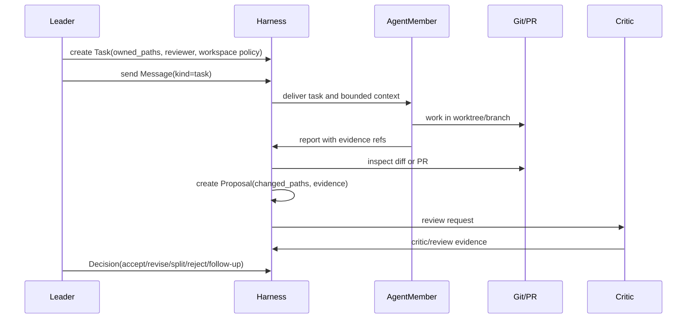

# Git, PR, And Review Workflow

This document defines how task graph work integrates with Git worktrees,
branches, pull requests, review, proposals, and Leader decisions.

## Vision Link

The harness must support multiple agent members developing concurrently without
turning Git into the only source of memory. Git owns code-change facts. The
harness owns work ownership, assignment, evidence, review, and decisions.

Final acceptance for this mechanism:

```text
Task
  -> Message(kind=task)
  -> AgentMember works in declared workspace/branch
  -> Proposal from diff or PR
  -> Evidence and review
  -> Leader Decision
  -> merge / revise / split / follow-up
```

## Key Relationships

| Concept | Meaning |
| --- | --- |
| `Task` | Work unit with owner, assignee, reviewer, dependencies, owned paths, and acceptance. |
| Worktree / branch | Execution workspace for a file-changing task. |
| PR | Git integration artifact and external review surface. |
| `Proposal` | Harness candidate for accepting a change or conclusion. |
| Review / critic | Evidence about quality, risk, path ownership, and acceptance. |
| `Decision` | Leader outcome; not the same as PR merge. |

## Workflow



## Concurrency Rules

- One file-changing task should use one worktree or clearly declared workspace.
- Parallel tasks need disjoint `owned_paths` or an explicit integration task.
- Workers may read the full repo but should write only within owned paths.
- A worker must not revert unrelated user or agent changes.
- Path conflicts create a Leader decision: split, serialize, or integrate.

## Proposal Rules

A proposal is the harness-level acceptance candidate. It should include:

```text
Proposal
  task_id
  agent_member_id
  summary
  changed_paths
  diff_ref or pr_ref
  check_evidence
  review_evidence
  known_risks
```

PR URLs, commits, and diffs are evidence or refs inside a proposal. They do not
replace the proposal because they do not carry harness acceptance criteria,
task ownership, or Leader decision state.

## Review And Decision

Review checks:

- task objective and acceptance criteria;
- changed paths and owned-path compliance;
- tests, checks, or fixture evidence;
- worker report and provider/session evidence when applicable;
- risk, blocker, or waiver requests;
- whether follow-up tasks are needed.

Leader decisions:

| Decision | Meaning |
| --- | --- |
| accept | proposal meets task acceptance and can be integrated or closed |
| revise | worker or new task must address issues |
| split | task is too broad or evidence changed the plan |
| reject | result should not be used |
| block | external state or missing evidence prevents progress |
| follow-up | accepted work creates new work or governance improvement |

PR merge can be an effect of an accepted decision. It is not itself the
decision.

## Watchers And Observer

A watcher is not a task. It observes state and can create evidence, messages,
blockers, or follow-up tasks.

Examples:

- watch CI status for a PR;
- watch provider runtime for stale events;
- watch owned-path conflicts;
- watch review comments;
- watch dashboard warnings.

Watch output becomes useful only after it is recorded into harness evidence or
messages.

Observer is the durable AgentMember role that coordinates these watches across
a long-running goal or project. A watcher may observe one PR, runtime, or
warning stream; Observer turns repeated watch output into proposed goals,
task-graph changes, blockers, or follow-up work for Lead decision.

## Invariants

1. A file-changing task names workspace or owned-path policy before review.
2. Proposal acceptance requires evidence beyond the worker's summary.
3. PR merge is not equal to task acceptance.
4. Review evidence precedes Leader decision for non-trivial changes.
5. Concurrent work must be visible in task graph and workspace refs.
