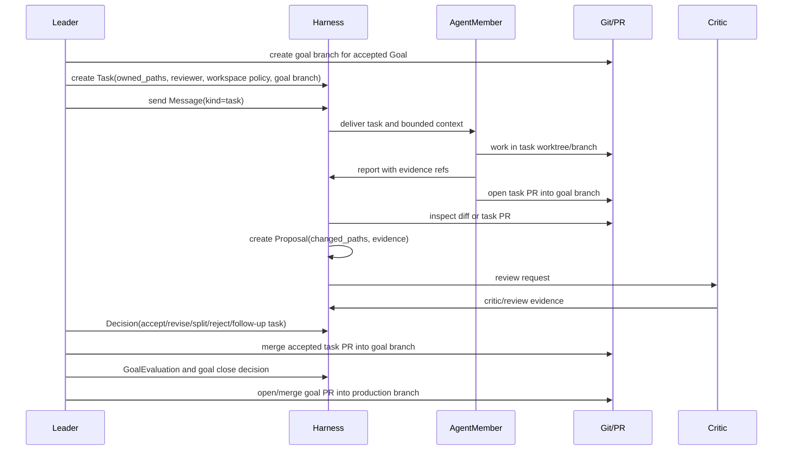

# Git, PR, And Review Workflow

This document defines how task graph work integrates with Git worktrees,
branches, pull requests, review, proposals, and Leader decisions.

## Vision Link

The harness must support multiple agent members developing concurrently without
turning Git into the only source of memory. Git owns code-change facts. The
harness owns work ownership, assignment, evidence, review, and decisions.

Final acceptance for this mechanism:

```text
Goal
  -> goal branch
  -> Task
  -> Message(kind=task)
  -> AgentMember works in declared worktree/task branch when files change
  -> task PR into goal branch (or per-phase landing commit in the
     orchestrated `goal run-phases` flow)
  -> Proposal from diff or PR evidence
  -> Evidence and review
  -> Leader Decision
  -> task merge / revise / split / follow-up
  -> GoalEvaluation
  -> goal PR into production branch
```

## Key Relationships

| Concept | Meaning |
| --- | --- |
| `Goal` | Durable outcome that owns an integration branch and closeout standard. |
| Goal branch | Integration branch for all accepted file-changing task work inside one goal, usually `goal/<goal-id>` or `goal-<goal-id>`. |
| `Task` | Work unit with owner, assignee, reviewer, dependencies, owned paths, and acceptance. |
| Task worktree / branch | Execution workspace for a file-changing task. |
| Task PR | PR from task branch to goal branch after task review. |
| Goal PR | PR from goal branch to production branch after goal acceptance and evaluation. |
| `Proposal` | Harness candidate for accepting a change or conclusion. |
| Review / critic | Evidence about quality, risk, path ownership, and acceptance. |
| `Decision` | Leader outcome; not the same as PR merge. |

## Branch Model

The repository should use a two-level integration model for file-changing goals:

```text
production branch
  <- goal branch
       <- task branch / worktree
       <- task branch / worktree
       <- task branch / worktree
```

Rules:

- each non-trivial file-changing goal creates or owns one goal branch;
- the goal branch is the integration target for accepted task PRs;
- each file-changing task runs in its own disposable worktree when it needs
  isolation, parallelism, or path ownership; the orchestrated runtime creates
  a unique throwaway worktree per writable leaf, and keeps read-only leaves on
  the shared project root (isolating a read-only leaf only when its provider
  cannot enforce read-only);
- task work integrates into the goal branch through task-level review: a task
  PR in the standing-team flow, or a passing phase's landing commit in the
  orchestrated `goal run-phases` flow (see Phase Landing below);
- task PRs, where used, target the goal branch, not the production branch;
- goal branch integration into production happens only after goal acceptance:
  task graph complete or explicitly blocked, evidence present, review complete,
  Leader decision recorded, and GoalEvaluation present or waived;
- a documentation-only, investigation-only, or no-file task may report evidence
  without a task branch, but that exception should be visible in the task's
  workspace/proposal state;
- production branch merges are goal-level decisions, not worker-level actions.

## Phase Landing (Implemented Integration Path)

The orchestrated phase loop (`goal run-phases`) implements task-level
integration without per-task PRs:

- writable leaves run in unique harness-owned throwaway worktrees; the diff is
  captured (with `--binary`) as evidence before the worktree is discarded, and
  stale worktrees left by dead runs are reclaimed (`workflow gc-worktrees`);
- owned-path compliance is enforced mechanically when a writable leaf's diff
  is captured, not only checked at review;
- a passing phase is the single landing authority: it applies every
  non-rejected, non-discarded writable diff in deterministic order and makes
  one landing commit on the current branch. Landing refuses to start on a
  dirty tree, and a failed apply rolls back to the pre-landing HEAD — no
  auto-merge, no force;
- a workflow's `reject_patch()` intent or a leaf's `persist_changes="discard"`
  excludes that step's diff from the landing commit;
- orchestrated runs persist no standalone patches. Standalone
  `workflow run-script` writable diffs instead persist as pending
  `WorkflowPatch` rows (only when the leaf succeeded and was writable) for
  explicit apply/reject review;
- `goal reconcile-phase` trues up a phase that was landed or fixed
  out-of-band.

The goal PR into production remains the outer integration step in both the
standing-team PR flow and the phase-landing flow.

## Workflow



## Concurrency Rules

- One file-changing task should use one worktree or clearly declared workspace.
- Parallel tasks need disjoint `owned_paths` or an explicit integration task.
- Parallel task work integrates into the goal branch after task-level review —
  as merged task PRs or as a passing phase's landing commit; it does not bypass
  the goal branch and merge directly into production.
- Workers may read the full repo but should write only within owned paths; the
  workflow runtime enforces this when capturing a writable leaf's diff.
- A worker must not revert unrelated user or agent changes.
- Path conflicts create a Leader decision: split, serialize, or integrate.

## Standing Agent Teams

`AgentTeam` is a persistent organization, not a one-task execution bundle.

Rules:

- a standing team can work across multiple goals and preserve role identity,
  inbox/outbox history, provider sessions, and prior decisions;
- `GoalDesign` chooses the team shape for one goal by reusing standing members,
  adding specialist members when needed, or explicitly recording a role gap;
- creating a new team for every task or closing a team when one task completes
  is a workflow smell unless a Leader decision explains why the team is
  temporary;
- task worktrees and task branches are disposable execution surfaces; AgentTeam
  and AgentMember identities are durable coordination state;
- the Dashboard should show both the standing team and the selected goal's team
  design so users can see whether a goal is properly staffed.

## Proposal Rules

A proposal is the harness-level acceptance candidate. It should include:

```text
Proposal
  task_id
  agent_member_id
  summary
  changed_paths
  diff_ref or pr_ref
  check_evidence
  review_evidence
  known_risks
```

PR URLs, commits, and diffs are evidence or refs inside a proposal. They do not
replace the proposal because they do not carry harness acceptance criteria,
task ownership, or Leader decision state.

## Review And Decision

Review checks:

- task objective and acceptance criteria;
- changed paths and owned-path compliance;
- tests, checks, or fixture evidence;
- worker report and provider/session evidence when applicable;
- risk, blocker, or waiver requests;
- whether follow-up tasks are needed.

Leader decisions:

| Decision | Meaning |
| --- | --- |
| accept | proposal meets task acceptance and can be integrated or closed |
| revise | worker or new task must address issues |
| split | task is too broad or evidence changed the plan |
| reject | result should not be used |
| block | external state or missing evidence prevents progress |
| follow-up | accepted work creates new work or governance improvement |

PR merge can be an effect of an accepted decision. It is not itself the
decision.

## Watchers And Observer

A watcher is not a task. It observes state and can create evidence, messages,
blockers, or follow-up tasks.

Examples:

- watch CI status for a PR;
- watch provider runtime for stale events;
- watch owned-path conflicts;
- watch review comments;
- watch dashboard warnings.

Watch output becomes useful only after it is recorded into harness evidence or
messages.

Observer is the durable AgentMember role that coordinates these watches across
a long-running goal or project. A watcher may observe one PR, runtime, or
warning stream; Observer turns repeated watch output into proposed goals,
task-graph changes, blockers, or follow-up work for Lead decision.

## Invariants

1. A file-changing task names workspace or owned-path policy before review.
2. Proposal acceptance requires evidence beyond the worker's summary.
3. Task PR merge is not equal to task acceptance.
4. Goal PR merge is not equal to goal acceptance.
5. Review evidence precedes Leader decision for non-trivial changes.
6. Concurrent work must be visible in task graph and workspace refs.
7. Task branches target the goal branch; goal branches target production.
8. AgentTeams persist across tasks and goals unless retired by explicit
   lifecycle decision.
9. A phase landing commit is an effect of a passing phase verdict; it lands
   only non-rejected, non-discarded writable diffs and does not substitute for
   goal acceptance or the goal PR.
