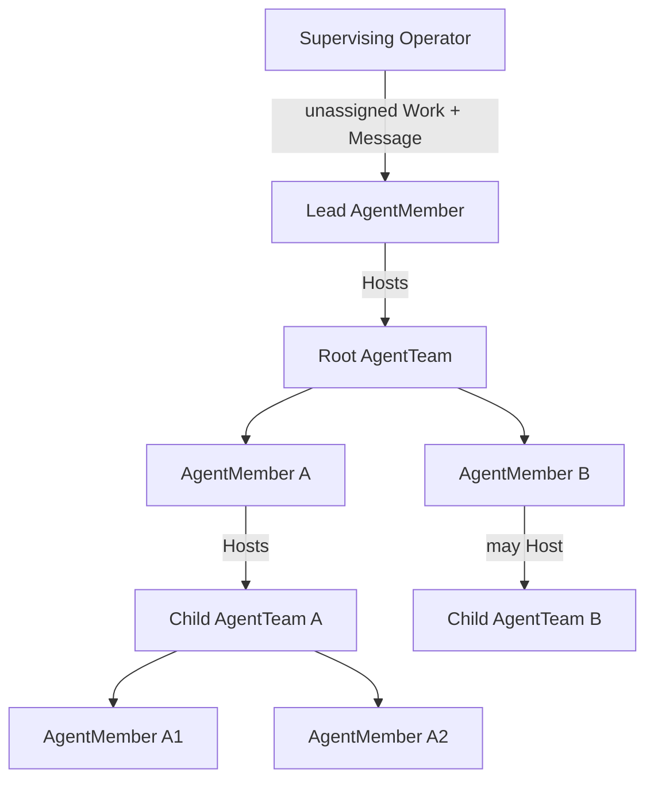

# Nested Agent Team Organization Design

```text
status: proposed technical design
owner_role: product-architecture
requirements: specs/nested-agent-team-organization/requirements.md
```

## Design thesis

Organization is not a scheduler layered above Agent Team. It is the persistent
recursive projection of Agent Teams and AgentMembers. Work is the only durable
responsibility primitive. Message remains authored conversation. Runtime state
is replaceable execution detail.



`Host` is a relation between one AgentMember and one AgentTeam. It is not a
second Agent identity. The root Lead, Domain Leads, and lower coordinators use
the same object and runtime contracts.

## Target object model

### AgentMember

AgentMember becomes the durable Agent identity used by Organization and Agent
Team.

```text
AgentMember
- id
- name / role / description
- provider profile and model controls
- workspace and project-binding policy
- business-access ceiling refs[]
- status = active | paused | retired
- created_by_member_id?
- created_at / updated_at
```

Provider process and current execution state remain outside AgentMember:

```text
AgentMember -> MemberRun -> provider-native Session
```

MemberRun may be closed, reopened, replaced, or reconciled without mutating
the organization identity.

### AgentTeam

```text
AgentTeam
- id
- name / purpose
- parent_team_id?            # null for root
- host_member_id             # durable AgentMember
- member_ids[]               # direct children only
- status = active | paused | archived
- created_at / updated_at
```

Invariants:

1. A non-root Team's Host must be a direct Member of its parent Team.
2. A Member may Host at most one primary child Team in V1.
3. The Team graph is acyclic.
4. A Member name, Provider Session, workspace path, or Work assignee never
   implies Team ancestry.
5. Human, external, and service actors may appear as related collaborators but
   do not become AgentMembers without an explicit adapter contract.

### Work kernel

The existing Agent Team Work semantics become the base. The target scope moves
from one TeamRun to a persistent AgentTeam while execution attempts remain
optional refs.

```text
Work
- id
- team_id
- execution_team_run_id?
- parent_work_id?
- created_by_member_id?      # null for Supervising Operator / external intake
- created_by_actor_ref
- assignee_member_id?
- claimable = false | true
- status = open | in_progress | blocked | review | done | cancelled
- title
- context_markdown
- completion_criteria_markdown
- result_summary?
- blocker_reason?
- source_refs[]              # Document, Milestone, Module, external request
- artifact_refs[]
- check_refs[]
- version
- created_at / updated_at
```

Assigned/unassigned is a view:

```text
unassigned = status == open && assignee_member_id == null
assigned   = status == open && assignee_member_id != null
```

Organization extends Work with relations rather than a competing status row:

```text
WorkRelation
- work_id
- kind = source_document | result_document | milestone | business_module |
         approval | finance | external_delivery | mission
- target_ref
```

The current Company WorkItem and Assignment ledgers remain implementation
truth until migration. The target cutover must convert or reset active rows and
then remove dual responsibility writes. It must never make both models live.

### WorkEvent and WorkDelivery

WorkEvent remains the semantic transition record. A versioned Work operation
atomically writes the new Work projection and any WorkDelivery required for a
Member runtime.

Host assignment, self-assignment, resume, and request-changes create or update
WorkDelivery. WorkDelivery is not an authored Message.

### TeamMessage

```text
TeamMessage
- id
- team_id
- from_actor/member
- to_actor/member
- work_id?
- body_markdown
- response_intent
- correlation / reply lineage
- delivery state
```

Messages may explain Work but never mutate owner or lifecycle. Assignment
Message does not return.

## Administrative rules

Topology supplies the minimum scheduling authority:

| Actor | Create unassigned | Assign self | Assign direct Member | Create child Team | Accept Work |
| --- | --- | --- | --- | --- | --- |
| Supervising Operator | Any visible Team scope | No | No | No | No |
| Ordinary Member | Current Team | Own created Work | No | Own child Team | Own child Works when acting as child Host |
| Team Host | Hosted Team | Yes | Yes | Yes | Direct Member submissions |

These rules do not grant business effects. Docs, Finance, legal, credential,
external, and irreversible operations continue to apply their own narrow
policies. V1 avoids a general organization permission graph: a parent cannot
delegate execution scope it does not hold, and a Member cannot administer
siblings or ancestors.

## Delegation algorithm

Suppose Member `CTO` owns root Work `W0` and Hosts child Team `T1`.

1. CTO creates `W1`, `W2`, and `W3` in `T1` with `parent_work_id = W0`.
2. CTO assigns each child Work to a direct child Member.
3. WorkDelivery wakes or queues each target runtime.
4. Children execute and submit their own Work.
5. CTO accepts or requests changes on child Works.
6. CTO integrates accepted child outcomes and submits `W0` to the parent Host.
7. Parent Host accepts or requests changes on `W0`.

Child completion never automatically completes `W0`. Delegation transfers
execution, not the delegator's accountability to its parent.

## Runtime and mailbox behavior

The durable Supervisor contract remains unchanged:

| Runtime state | Work/Message behavior |
| --- | --- |
| idle | Claim next eligible WorkDelivery and start one provider cycle. |
| busy | Queue ordinary delivery; use reviewed live steer only when explicitly requested. |
| offline/dead | Keep delivery durable, reconcile runtime generation, resume compatible native Session, deliver once. |
| closed | Freeze delivery until explicit reopen. |
| retired | Reject new WorkDelivery and require Host reassignment. |

Exactly one top-level driver may control a writable MemberRun/workspace.
Provider-native subagents remain internal to their invoking Member and never
appear as Organization nodes unless explicitly promoted to AgentMember.

## Supervising Operator boundary

The Supervising Operator is an external control role shared by the Human and
the current AI task. It receives a global read projection and can:

- create unassigned Work in a selected Team;
- send a durable Message to the Lead;
- inspect Team, Member, Work, delivery, runtime, and native-session refs; and
- request runtime controls through the Supervisor.

It cannot forge Member-originated Message, assign peers, accept Work, or create
child Teams. Urgent demand is an unassigned Work plus a Lead Message.

## API and CLI target

The concrete command names may evolve, but one application service must back
CLI, HTTP/MCP, Dashboard, and Plugin:

```text
harness org tree
harness org team create --host-member <id> [--parent-team <id>]
harness org member create --team <id> ...
harness team work create --team <id> [--assignee self]
harness team work assign --work <id> --member <direct-member>
harness team work list --team <id> [--recursive]
harness team work submit|accept|request-changes ...
harness team send --to <lead-or-member> --work <id> ...
```

Member commands require the bound MemberRun identity. Operator commands record
the Supervising Operator origin and are restricted to unassigned creation and
Lead communication.

## UI architecture

### Organization overview

- recursive Team tree sourced from explicit `parent_team_id`, `host_member_id`,
  and `member_ids`;
- per-node current Work counts: assigned, in progress, blocked, review;
- runtime state shown separately from durable Agent status;
- drilldown from Member to its child Team.

### Global Works

- one aggregate projection over the recursive Team tree;
- filters for Team path, Host, Member, status, source, and milestone;
- parent/child lineage and responsible Member always visible;
- unassigned Work is a first-class queue.

### Member Focus

Reuse the accepted Agent Team Member Focus components:

- current owned Work and completion criteria;
- created Work and child Work;
- child Team and direct Members;
- Inbox/Outbox and Work-linked conversation;
- runtime, workspace, Provider, and native-session facts;
- create unassigned, take own Work, split Work, and delegate to direct child.

### Team War Room

Continue to use Works, Activity, Members, mailboxes, and truthful capacity.
Organization adds breadcrumbs and recursive drilldown; it does not create a
second War Room implementation.

## Mission/Wave boundary

Mission/Wave is optional. It is appropriate for durable outcomes spanning
multiple Teams or material Host replanning. Work still owns responsibility.
Wave still owns Host plan/judgment. Mission never becomes the Organization
root or the Work board.

## Migration strategy

1. Freeze target schemas and application-service APIs.
2. Introduce recursive AgentTeam relations and persistent Team-scoped Work in
   a fresh Execution/Company test space.
3. Project current StandingAgent and Company WorkItem rows into a migration
   report; do not dual-write.
4. Validate identities, hierarchy, owner/status, source/result refs, and
   approvals before cutover.
5. Switch Organization, Work, Agent Team, Skills, and Dashboard together.
6. Archive old compatibility ledgers after an explicit export and verification.

## Test strategy

- graph invariants: root, direct host, cycle rejection, subtree isolation;
- Work authority: unassigned, self-assign, Host assignment, peer denial,
  delegation, parent accountability;
- delivery: busy, idle, crash/recovery, close/reopen, retire;
- provider-neutral live canaries for Codex, Claude, and Kimi;
- Dashboard exact-relation tests and recursive navigation;
- migration refusal when two responsibility authorities would remain active;
- end-to-end Lead -> CTO -> child Team scenario from the requirements.
