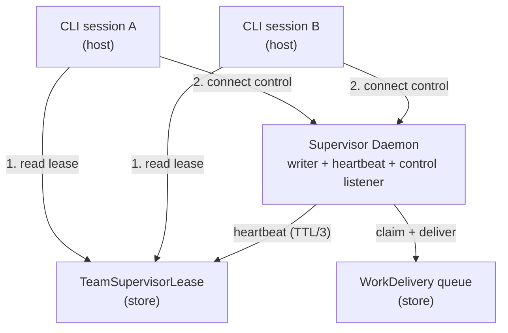
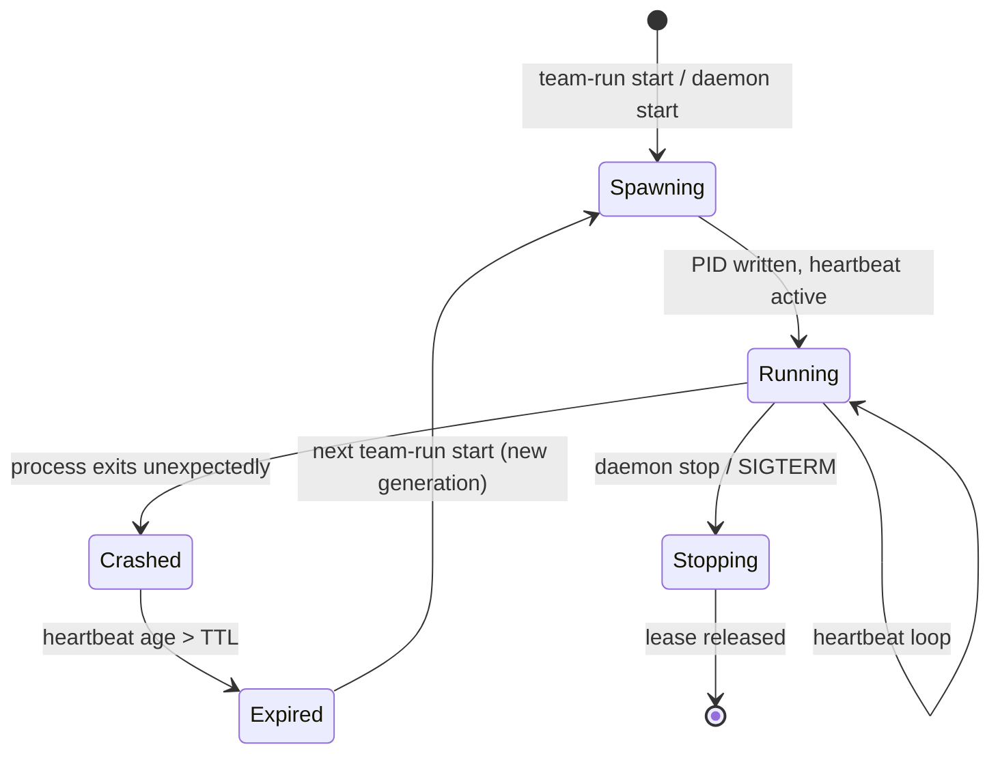
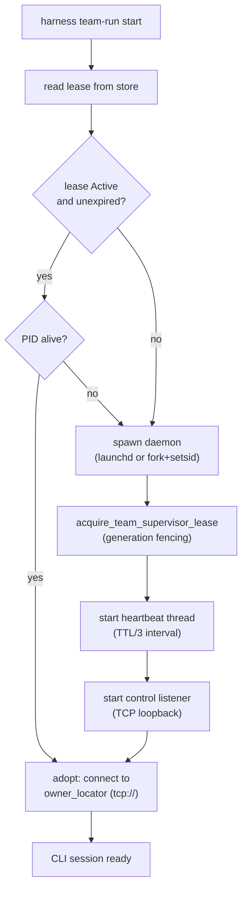
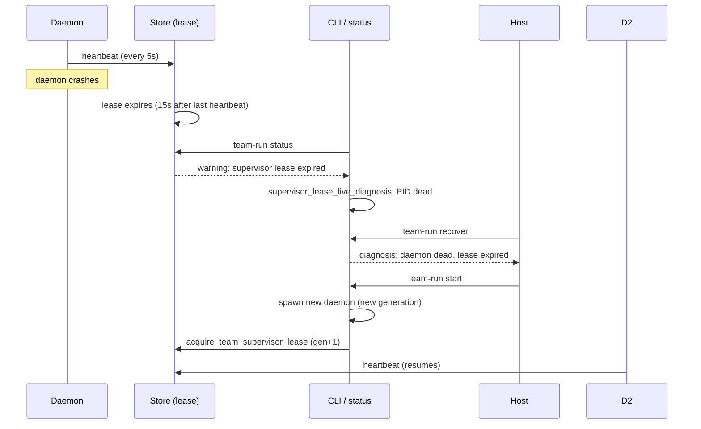

# Supervisor Daemonization Design

```text
status: proposed technical design
owner_role: platform
requirements: specs/supervisor-daemonization/requirements.md
references:
  - issue #340 (supervisor silent death, silent-queue failure family)
  - issue #343 (detection: is_supervisor_current, recover diagnosis, status warnings)
  - issue #346 (this design spike)
```

## Motivation

Wave 2 and Wave 3 both hit the same failure family three times: a host CLI session
died (terminal closed, SSH dropped, laptop slept), taking the in-process supervisor
writer with it. Ready works sat frozen in the queue with no writer to claim them.
Issue #340 and #343 added the detection layer:

- `supervisor_lease_live_diagnosis` — checks whether the PID recorded in the lease
  is still alive
- `is_supervisor_current` — checks whether the lease is Active and unexpired
- `team-run recover` — diagnoses the lease state and recommends next action
- `team-run status` — surfaces supervisor lease warnings to the operator

These diagnostics **detect** the failure but do not **prevent** it. The structural
gap remains: the supervisor writer is coupled to the CLI process lifecycle. When the
CLI process exits, the writer exits with it. No writer = no work delivery progress.

This design spike defines a daemon architecture that gives the supervisor writer a
persistent home, independent of any CLI session. The deliverable is this document,
not implementation code.

## Architecture overview

The supervisor writer moves from an in-process thread to a detached daemon process.
CLI sessions connect to the daemon over a TCP loopback control channel — the same
channel that already exists today as `owner_locator` (tcp://addr) in the lease.



The existing design primitives support this directly:

- **Generation fencing** (`acquire_team_supervisor_lease` in `harness-store`):
  same `supervisor_id` → idempotent; different `supervisor_id` with expired lease →
  new generation. This is the handoff mechanism.

- **TCP loopback control listener**: already running in the supervisor thread,
  address recorded as `owner_locator`. CLI clients can read the locator from the
  lease and connect.

- **Heartbeat thread**: already writes `heartbeat_unix_ms` at TTL/3 intervals
  (default 15s TTL → 5s heartbeat).

- **`LIVE_TEAM_SUPERVISORS`**: already prevents duplicate in-process supervisor
  instances.

The daemonization change decouples the supervisor process lifetime from the CLI
process lifetime while reusing all four primitives.

## 1. Daemon lifecycle

### 1.1 Spawn

The daemon is spawned on the first `harness team-run start` invocation when no
active supervisor lease exists. An explicit `harness supervisor daemon start`
command provides direct operator control.

**macOS — launchd (preferred)**

Submit a user LaunchAgent plist:

```xml
<?xml version="1.0" encoding="UTF-8"?>
<!DOCTYPE plist PUBLIC "-//Apple//DTD PLIST 1.0//EN"
  "http://www.apple.com/DTDs/PropertyList-1.0.dtd">
<plist version="1.0">
<dict>
    <key>Label</key>
    <string>com.harness.supervisor</string>
    <key>ProgramArguments</key>
    <array>
        <string>/path/to/harness</string>
        <string>supervisor</string>
        <string>daemon</string>
        <string>serve</string>
        <string>--team-run-id</string>
        <string>...</string>
    </array>
    <key>KeepAlive</key>
    <true/>
    <key>RunAtLoad</key>
    <true/>
    <key>StandardOutPath</key>
    <string>/tmp/harness-supervisor.stdout.log</string>
    <key>StandardErrorPath</key>
    <string>/tmp/harness-supervisor.stderr.log</string>
</dict>
</plist>
```

`KeepAlive` ensures launchd restarts the daemon if it crashes. The plist path is
`~/Library/LaunchAgents/com.harness.supervisor.plist`.

**Portable fallback — fork + setsid + nohup**

For Linux and other Unix systems without launchd:

```text
fork() → child: setsid() → exec("harness supervisor daemon serve ...")
stdin: /dev/null; stdout/stderr: log files
```

The spawning CLI process records the child PID and exits. The daemon acquires the
lease, starts the heartbeat/control threads, and writes its PID to the lease.

### 1.2 Lifecycle state machine



| State | Lease status | heartbeat_unix_ms | owner_process_id | Meaning |
|-------|-------------|-------------------|------------------|---------|
| Spawning | Active | 0 (not yet) | current PID | Daemon starting |
| Running | Active | recent | current PID | Normal operation |
| Crashed | Active | stale (> TTL) | dead PID | Daemon process gone |
| Expired | Active | stale | dead PID | Lease past expiry |
| Stopping | Released / Active | recent → none | current PID | Graceful shutdown |

`team-run status` surfaces these states:

- **Running**: green, heartbeat age reported
- **Crashed/Expired**: yellow/red warning, suggests `team-run recover` or `team-run start`
- **Spawning**: transient, not normally visible to status

### 1.3 Adoption

When a CLI session runs `team-run start` and finds an active (Running) daemon
lease, it adopts the daemon rather than spawning a new one:

1. Read lease from store
2. If `status == Active` and `expires_unix_ms > now`:
   a. `supervisor_lease_live_diagnosis` checks PID aliveness
   b. If PID alive → adoption path
   c. If PID dead → spawn path (Section 1.1)
3. Adoption: connect to `owner_locator` (tcp:// address from lease)
4. CLI now communicates with the daemon over the control channel

Generation fencing via `acquire_team_supervisor_lease` guarantees only one writer
exists at any time. Same `supervisor_id` reconnecting → idempotent. Different
`supervisor_id` with expired lease → legitimate handoff with new generation.

## 2. Handoff protocol

### 2.1 CLI start flow



### 2.2 Generation fencing details

`acquire_team_supervisor_lease` (in `harness-store`) already implements the
required fencing. The semantics are:

| Current lease state | Caller | Result |
|---------------------|--------|--------|
| No lease exists | Any | Create new lease, generation=1 |
| Active, unexpired, same `supervisor_id` | Same daemon reconnecting | Idempotent — return existing lease |
| Active, unexpired, different `supervisor_id` | Second writer attempt | Reject — `Err(SupervisorAlreadyActive)` |
| Active, expired (>TTL), different `supervisor_id` | New daemon after crash | Accept — new generation (prev+1), compaction |
| Released | Any | Accept — new generation |

This prevents the "two writers" failure mode. The daemon holds the lease; a second
CLI attempting to spawn a daemon is rejected. A crashed daemon's lease expires,
allowing a new generation.

### 2.3 Daemon reconnection

When a CLI session disconnects (terminal closed, network hiccup), the daemon
continues running. On reconnection:

1. New CLI runs `team-run start`
2. Finds Active lease with same team-run-id
3. Adopts by reconnecting to the control listener
4. Daemon resumes sending work deliveries to the new CLI session

Work state (claim, delivery, member runs) is preserved in the store during the
gap. No work is lost.

### 2.4 Port allocation

The daemon binds a TCP loopback port on a random available port (or a fixed port
configured via `harness config`). The `owner_locator` field in the lease records
the address (e.g., `tcp://127.0.0.1:9527`). CLI clients read the locator from the
lease, not from a hardcoded port.

## 3. Lease/heartbeat contract

### 3.1 Lease schema

The existing `TeamSupervisorLease` structure is the contract:

```text
TeamSupervisorLease
- supervisor_id: String        # unique daemon identity
- generation: u64              # incremented on crash/handoff
- owner_process_id: u32        # daemon PID
- owner_locator: String        # tcp://127.0.0.1:<port>
- status: Active | Released    # graceful shutdown sets Released
- heartbeat_unix_ms: i64       # updated every heartbeat
- expires_unix_ms: i64         # heartbeat_unix_ms + TTL
```

### 3.2 Timing contract

| Parameter | Default | Meaning |
|-----------|---------|---------|
| TTL | 15s | Lease valid duration from last heartbeat |
| Heartbeat interval | TTL/3 = 5s | Daemon writes heartbeat_unix_ms |
| Expiry detection | heartbeat_unix_ms + TTL < now | CLI/status considers daemon dead |
| Crashing timeout | TTL | Max time between daemon crash and detection |

The 15s TTL is a trade-off: short enough that a crashed daemon is detected quickly
(worst case: one heartbeat cycle after crash = 5s, plus TTL expiry = 15s, total
≤ 20s), long enough that transient CPU contention or filesystem lag does not
trigger false expiry.

### 3.3 CLI client obligations

CLI clients **read** the lease but never **write** to it directly:

- Read `status`, `expires_unix_ms`, `owner_locator` on `team-run start`
- Read `heartbeat_unix_ms` on `team-run status`
- Read `owner_process_id` on `team-run recover` (for PID liveness check)

Only the daemon writes `heartbeat_unix_ms`. Only `acquire_team_supervisor_lease`
writes the full lease record, and it is called exclusively by the daemon (or a
CLI spawning a new daemon).

### 3.4 Store compaction

Each `acquire_team_supervisor_lease` call triggers compaction of stale supervisor
leases for the same team. This prevents lease accumulation across generations.

## 4. Failure semantics

### 4.1 Daemon crash



No new silent failure mode is introduced. The daemon crash flows directly into the
detection path already built in #340 and #343:

1. Heartbeat stops → lease expires
2. `team-run status` shows yellow/red warning
3. `team-run recover` diagnoses PID dead, heartbeat age > TTL
4. Host runs `team-run start` → new daemon spawned with new generation
5. Delivery loop resumes normally

### 4.2 Works preservation during outage

During the window between daemon crash and restart (worst case ≤ 20s from crash to
detection, plus operator reaction time):

- **Works**: preserved in store, status unchanged
- **WorkDelivery**: preserved in store, claim state unchanged
- **MemberRun**: preserved in store, runtime state unchanged
- **Lease**: expires, triggering status/recovery path

On daemon restart, the delivery loop resumes from the stored state. No work is
lost; at most, in-flight delivery claims from the crashed daemon expire and are
re-claimed by the new daemon.

### 4.3 Graceful shutdown

`harness supervisor daemon stop` sends a shutdown signal to the daemon:

1. Daemon stops accepting new control connections
2. Daemon drains in-progress deliveries to completion
3. Daemon sets lease `status = Released`
4. Daemon closes control listener
5. Daemon exits

If the daemon is managed by launchd and `KeepAlive` is true, the CLI must also
unload the plist (`launchctl unload ...`) to prevent automatic restart.

### 4.4 CLI client disconnection (non-failure)

When a CLI session exits normally (terminal closed, SSH disconnect), the daemon
is **not affected**:

1. Control connection to that CLI session drops
2. Daemon continues heartbeat and delivery loop
3. Next CLI session runs `team-run start` → adoption → resumes

This is the primary benefit of daemonization: the writer outlives any single CLI
session.

### 4.5 Double-write prevention

The existing `LIVE_TEAM_SUPERVISORS` in-process guard is replaced by the lease
fencing (Section 2.2). Before the daemon acquires the lease, it checks whether a
lease already exists for this team-run-id with an active, unexpired status from a
different `supervisor_id`. If so, the daemon refuses to start and logs the
conflict. This prevents:

- Two daemon processes for the same team-run
- A daemon and an in-process supervisor for the same team-run
- Two CLI sessions racing to spawn daemons

### 4.6 PID reuse

PID reuse (a new process getting the same PID as a crashed daemon) is handled by
the generation field. Even if the PID matches, the expired lease and new generation
number prevent the system from mistaking the new process for the old daemon.
`acquire_team_supervisor_lease` requires a matching `supervisor_id` for idempotent
re-acquire; a new daemon has a new `supervisor_id`.

## Explicitly out of scope

- **Implementation code** — this is a design spike; no daemon binary, no launchd
  plist packaging, no build system changes
- **Cross-machine daemon** — the daemon runs on localhost only; remote supervisor
  is a separate problem
- **Daemon configuration UI** — TTL, port, and log path configuration through
  `harness config` is noted as a future capability but not designed here
- **Metrics/monitoring** — heartbeat age, crash count, and delivery throughput
  metrics are a future observability layer
- **Platform-specific init systems beyond launchd and fork+setsid** — systemd
  (Linux) is noted but not designed; the portable fallback covers it
- **Daemon upgrade during live operation** — upgrading the harness binary while
  the daemon is running is out of scope

## Test strategy (design validation, not implementation tests)

- **Adoption scenario**: spawn daemon, connect CLI, disconnect CLI, new CLI
  connects → same generation, delivery loop resumes
- **Crash scenario**: spawn daemon, kill -9 daemon, wait TTL, `team-run status`
  shows warning, `team-run recover` diagnoses dead PID, `team-run start` spawns
  new daemon with gen+1
- **Double-write prevention**: attempt to spawn two daemons for same team-run →
  second is rejected
- **Graceful shutdown**: `daemon stop` → lease becomes Released → next
  `team-run start` spawns new daemon
- **PID reuse test**: kill daemon, create dummy process with same PID, check that
  generation fencing prevents false adoption
